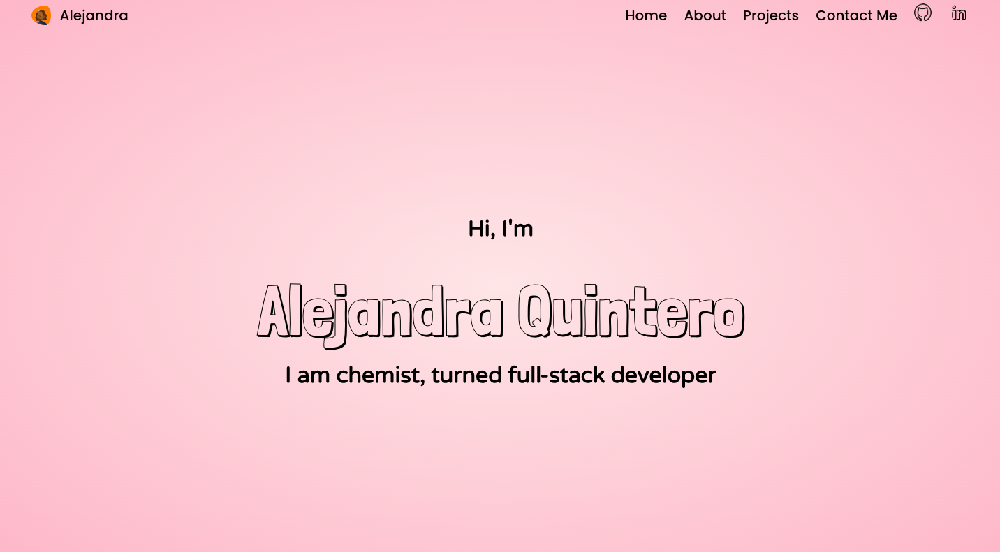
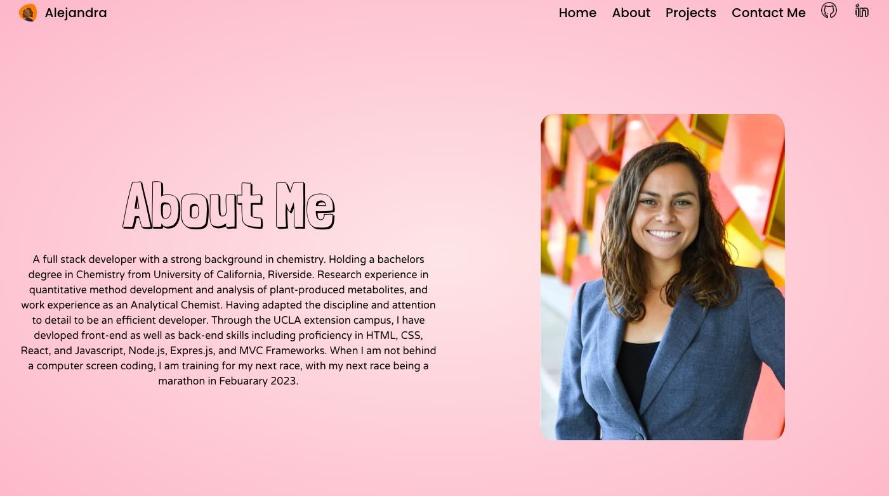
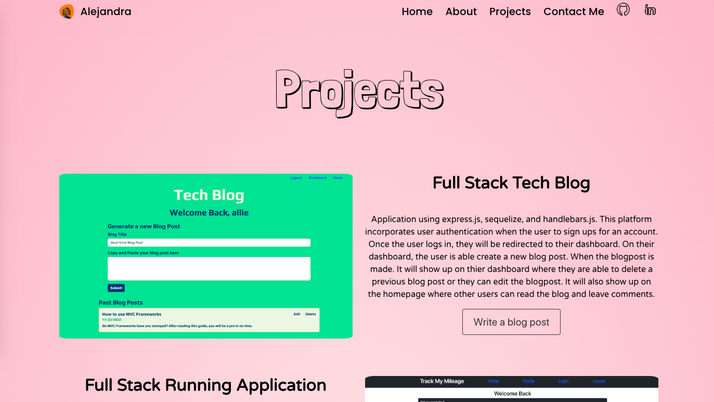
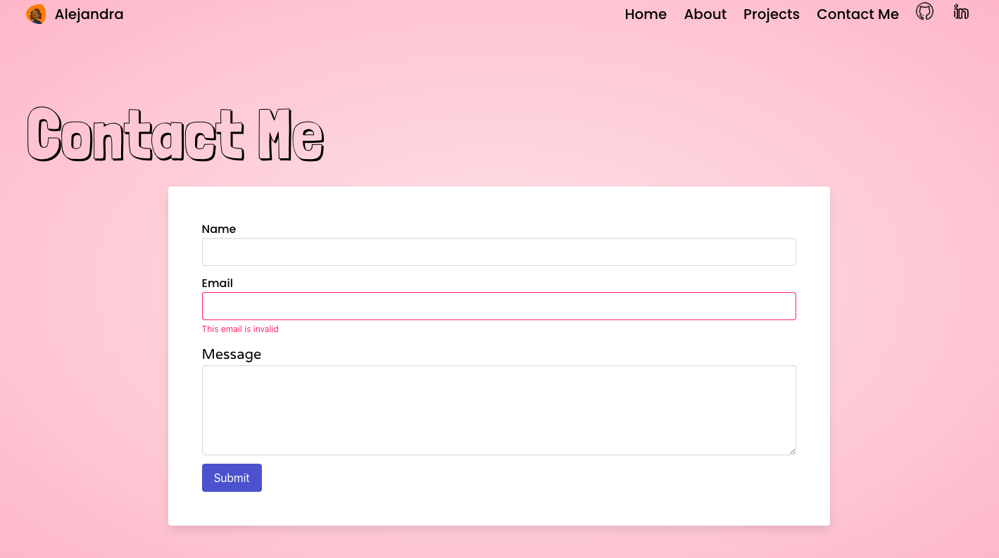

# Impressive Portfolio 

## Description 

A portfolio build with React build which showcases the best projects created throughout my coding bootcamp expierence as share  backgound information on my previous education and work expierence. This was my first project build with React which made it a learning expierence. Framer motion was integrated into the application to animate the elements within the pages. Difficulty involved 

## Installation 

In order to use the application click on the link below to view the portfolio and use the navigation bar to view the different pages. 

## Usage 

The user will first see the landing page 

To get to know Alejandra, navigate to the About Me page using the About button at the top of the page. 

To see some of the work that has been done, navigate to the Projects page using the Projects link at the top of the page. 

To contact Alejandra, navigate to the Contact Me page using the Contac link at the top of the page. 

## Credits 

I used Bulma as the front end framework and framer motion to create the animations in the webpages. 

I recived assistance from TA Meg Meyers to configure emailJS to the project contact page to foward emails from the application. 

## License

MIT License

Copyright (c) [2022] [AlejandraQuintero]

Permission is hereby granted, free of charge, to any person obtaining a copy of this software and associated documentation files (the "Software"), to deal in the Software without restriction, including without limitation the rights to use, copy, modify, merge, publish, distribute, sublicense, and/or sell copies of the Software, and to permit persons to whom the Software is furnished to do so, subject to the following conditions:

The above copyright notice and this permission notice shall be included in all copies or substantial portions of the Software.

THE SOFTWARE IS PROVIDED "AS IS", WITHOUT WARRANTY OF ANY KIND, EXPRESS OR IMPLIED, INCLUDING BUT NOT LIMITED TO THE WARRANTIES OF MERCHANTABILITY, FITNESS FOR A PARTICULAR PURPOSE AND NONINFRINGEMENT. IN NO EVENT SHALL THE AUTHORS OR COPYRIGHT HOLDERS BE LIABLE FOR ANY CLAIM, DAMAGES OR OTHER LIABILITY, WHETHER IN AN ACTION OF CONTRACT, TORT OR OTHERWISE, ARISING FROM, OUT OF OR IN CONNECTION WITH THE SOFTWARE OR THE USE OR OTHER DEALINGS IN THE SOFTWARE.